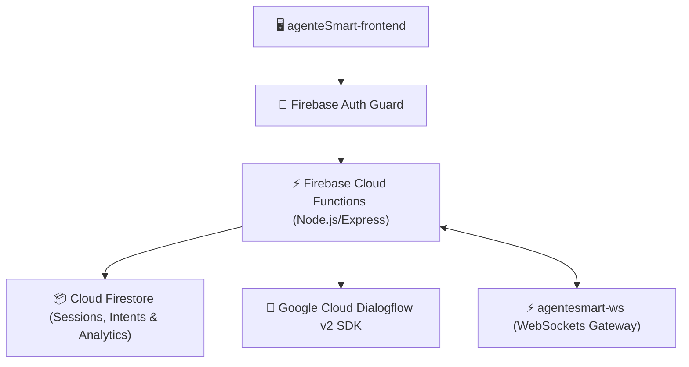

# ⚙️ AgenteSmart Backend — Serverless Dialogflow Orchestrator

A Serverless **Firebase Cloud Functions & Cloud Firestore** backend responsible for orchestrating **Google Dialogflow v2** agent communication, session persistence, user authentication, and real-time event triggers.

Part of the **AgenteSmart Full-Stack Suite**:
- 🖥️ [**`agenteSmart-frontend`**](https://github.com/jgu7man/agenteSmart-frontend) (Visual Angular Dashboard)
- ⚙️ [**`agenteSmart-backend`**](https://github.com/jgu7man/agenteSmart-backend) (Firebase Cloud Functions & Firestore API)
- ⚡ [**`agentesmart-ws`**](https://github.com/jgu7man/agentesmart-ws) (Real-Time WebSockets WhatsApp Bridge)

---

## 🏗️ Architecture & Responsibilities

---

## ✨ Key Capabilities

- 🤖 **Dialogflow SDK Abstraction:** Wraps Google Cloud Dialogflow v2 API with simplified endpoints for intent training and session state resolution.
- 📦 **Multi-Tenant Session Store:** Stores historical conversational turns and user session states on Cloud Firestore.
- 🛡️ **Security Rules & Validation:** Enterprise-grade Firestore security rules preventing unauthorized data mutations.

---

## 📄 License
Distributed under the [MIT License](LICENSE). Created by [Jorge Guzmán (@jgu7man)](https://github.com/jgu7man).
